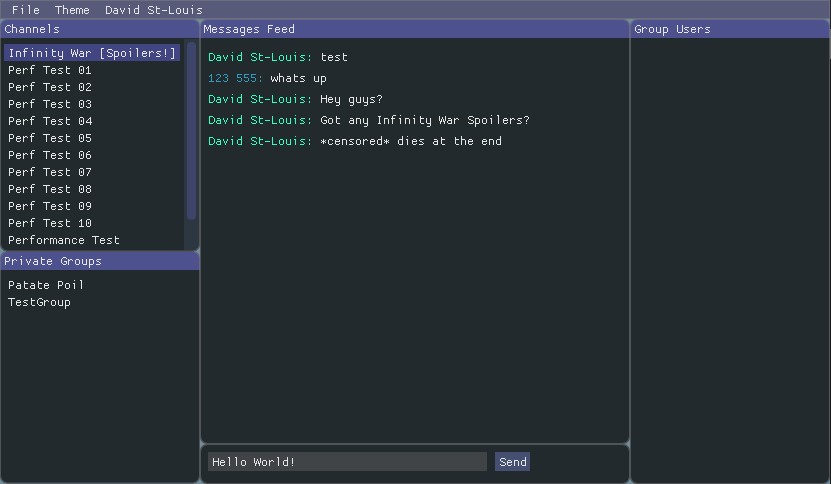

# BC Chat
brainCloud RTT Chat example, written in C++.



## How to Build
First you'll need to properly clone the project's submodules.
```
git submodule update --init
```
* [Build with CMake](#build-with-cmake)
* [Generate Xcode Project](#generate-xcode-project)
* [Use brainCloud cocoapods](#use-braincloud-cocoapods)

Then, create a file into /src folder called `ids.h`, and put 3 defines in it:
```
#define BRAINCLOUD_SERVER_URL "https://api.braincloudservers.com/dispatcherV2"
#define BRAINCLOUD_APP_ID ""
#define BRAINCLOUD_APP_SECRET ""
```

Fill in values for BRAINCLOUD_APP_ID and BRAINCLOUD_APP_SECRET.

### Build with CMake

1. Download and install cmake from: https://cmake.org.
   Or from terminal:

   Linux:
   ```
   sudo apt-get install cmake
   ```
   Mac:
   ```
   brew install cmake
   ```

2. Create a `build` directory, then `cd` to it.
   ```
   mkdir build
   cd ./build
   ```
3. Generate project
   ```
   cmake ..
   ```
   
4. Open the project then compile and run. If makefiles were used (Default CMake on non-windows), do this:
   ```
   make
   ./BCChat
   ```

### Generate Xcode Project

1. Create a `generated` directory, then `cd` to it.
   ```
   mkdir generated
   cd ./generated
   ```
   
2.   To generate an XCode project, use the cmake `Xcode` generator:
   ```
   cmake -G Xcode ..
   ```

3. Open the generated file BCChat.xcodeproj in Xcode, build and run.

### Use brainCloud cocoapods

1. Install cocoapods
   ```
   brew install cocoapods
   ```
2. Download SDL2 for Mac OS X from here https://www.libsdl.org/
3. Copy `SDL2.framework` to `/Library/Frameworks/`. (Command+Shift+G in finder)
4. `cd` to the Xcode project.
   ```
   cd ./macOS/
   ```
5. Install pods dependencies for this project.
   ```
   pod install
   ```
6. Open the pre-made Xcode project `./macOS/BCChat.xcworkspace` and run it.
