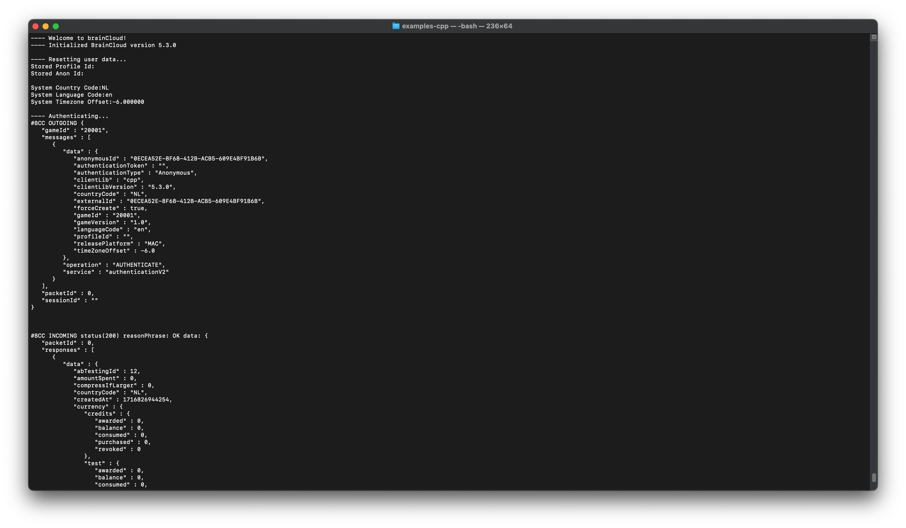

# Hello Braincloud!
This basic command-line app will test the basic functionality of initialization, authentication and RTT connection.



```
$ cd hellobc
$ mkdir build
$ cd build
$ cmake ..
$ cmake --build .
$ ./hellobc
```

To view the code, use a cmake generator and open the generated project file.

```
$ cd hellobc
$ mkdir gen
$ cd gen
$ cmake -G Xcode ..
```
